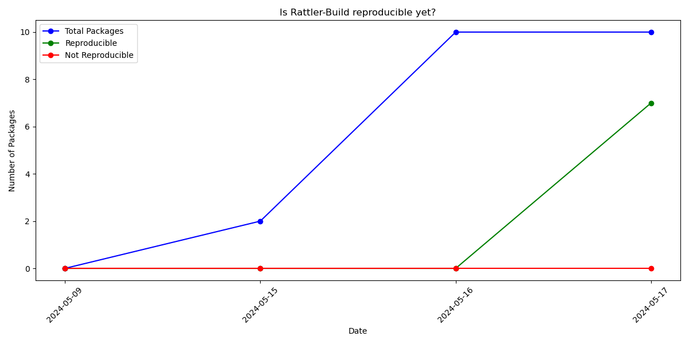

    # Are we reproducible yet?

    ![License][license-badge]
    [![Project Chat][chat-badge]][chat-url]

    [license-badge]: https://img.shields.io/badge/license-BSD--3--Clause-blue?style=flat-square
    [chat-badge]: https://img.shields.io/discord/1082332781146800168.svg?label=&logo=discord&logoColor=ffffff&color=7389D8&labelColor=6A7EC2&style=flat-square
    [chat-url]: https://discord.gg/kKV8ZxyzY4

    

    
    Built with rattler-build https://github.com/nichmor/rattler-build.git at commit fix/conda-timestamp-affect-reproducibility

Built on ubunutu 22.04 and rebuild on 20.04
    

| Recipe Name | Is Reproducible |
| --- | --- |
| polarify | Yes 🟢 |
| xtensor | Yes 🟢 |
| ros-humble-turtlebot4-msgs | No 🔴 |
| rich | Yes 🟢 |
| mamba | No 🔴 |
| zlink | No 🔴 |
| curl | No 🔴 |
| async-cairo | No 🔴 |
| cargo-edit | No 🔴 |

    
Build on macos 13 and rebuild on 12

        
| Recipe Name | Is Reproducible |
| --- | --- |
| polarify | Yes 🟢 |
| xtensor | Yes 🟢 |
| ros-humble-turtlebot4-msgs | No 🔴 |
| rich | Yes 🟢 |
| mamba | No 🔴 |
| zlink | No 🔴 |
| curl | No 🔴 |
| async-cairo | No 🔴 |
| cargo-edit | No 🔴 |
